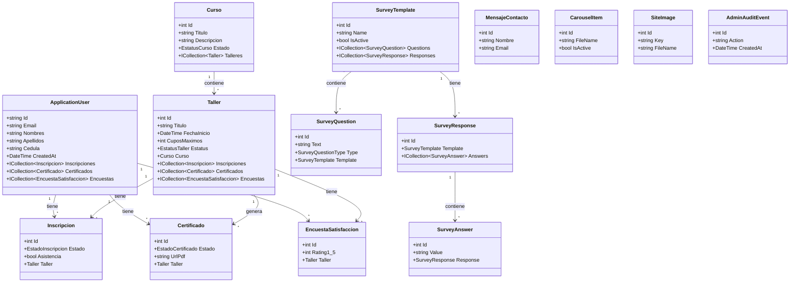

# Diagrama de Clases - Sumando Valor

## Modelo de Dominio

Este documento describe las clases principales del modelo de dominio de la aplicación.

## Enumeraciones

### EstatusCurso
- `Activo = 1`
- `Inactivo = 2`

### EstatusTaller
- `Abierto = 1`
- `Cerrado = 2`
- `Cancelado = 3`
- `Finalizado = 4`

### ModalidadTaller
- `Presencial = 1`
- `Virtual = 2`
- `Hibrido = 3`

### EstadoInscripcion
- `Activa = 1`
- `Cancelada = 2`

### EstadoCertificado
- `Pendiente = 1`
- `Aprobado = 2`
- `Rechazado = 3`

### EstadoMensaje
- `Nuevo = 1`
- `Leido = 2`
- `Archivado = 3`

### SurveyQuestionType
- `Rating1To5 = 1` - Radio buttons 1-5
- `Text = 2` - Texto corto/medio
- `SingleChoice = 3` - Opciones de radio
- `ScoreNumber = 4` - Puntuación numérica
- `Description = 5` - Texto largo/descripción
