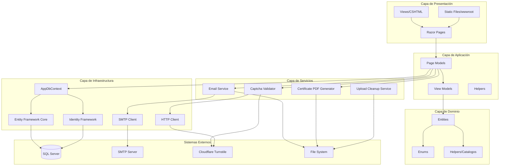

# Diagrama de Componentes - Sumando Valor

## Arquitectura de la Aplicación

Este documento describe la arquitectura de componentes y las capas de la aplicación.



## Descripción de Componentes

### Capa de Presentación

#### Razor Pages
- **Responsabilidad**: Manejo de requests HTTP, routing, y renderizado de vistas
- **Tecnología**: ASP.NET Core Razor Pages
- **Ubicación**: `src/SumandoValor.Web/Pages/`

#### Views/CSHTML
- **Responsabilidad**: Templates de presentación HTML
- **Tecnología**: Razor View Engine
- **Ubicación**: `src/SumandoValor.Web/Pages/**/*.cshtml`

#### Static Files
- **Responsabilidad**: Archivos estáticos (CSS, JS, imágenes)
- **Ubicación**: `src/SumandoValor.Web/wwwroot/`

### Capa de Aplicación

#### Page Models
- **Responsabilidad**: Lógica de negocio de cada página, validación de entrada
- **Ubicación**: `src/SumandoValor.Web/Pages/**/*.cshtml.cs`

#### View Models
- **Responsabilidad**: Modelos de datos para vistas
- **Ubicación**: `src/SumandoValor.Web/Pages/Shared/*.cs`

#### Helpers
- **Responsabilidad**: Utilidades de presentación (formateo de fechas, etc.)
- **Ubicación**: `src/SumandoValor.Web/Helpers/`

### Capa de Servicios

#### Email Service
- **Interfaz**: `IEmailService`
- **Implementaciones**:
  - `DevelopmentEmailService` (desarrollo - guarda en disco)
  - `SmtpEmailService` (producción - envía por SMTP)
- **Ubicación**: `src/SumandoValor.Infrastructure/Services/`

#### Captcha Validator
- **Interfaz**: `ICaptchaValidator`
- **Implementaciones**:
  - `MockCaptchaValidator` (desarrollo - siempre válido)
  - `CloudflareTurnstileCaptchaValidator` (producción)
- **Ubicación**: `src/SumandoValor.Infrastructure/Services/`

#### Certificate PDF Generator
- **Clase**: `CertificatePdfGenerator`
- **Tecnología**: QuestPDF
- **Responsabilidad**: Generación de certificados en PDF
- **Ubicación**: `src/SumandoValor.Web/Services/Certificates/`

#### Upload Cleanup Service
- **Clase**: `UploadCleanupService`
- **Responsabilidad**: Limpieza de archivos huérfanos en uploads
- **Ubicación**: `src/SumandoValor.Web/Services/`

### Capa de Infraestructura

#### AppDbContext
- **Responsabilidad**: Contexto de Entity Framework, configuración de entidades
- **Ubicación**: `src/SumandoValor.Infrastructure/Data/AppDbContext.cs`

#### Entity Framework Core
- **Responsabilidad**: ORM, migraciones, queries a base de datos
- **Tecnología**: EF Core 8.0

#### Identity Framework
- **Responsabilidad**: Autenticación, autorización, gestión de usuarios y roles
- **Tecnología**: ASP.NET Core Identity
- **Roles**: `Admin`, `SuperAdmin`, `Beneficiario`

### Capa de Dominio

#### Entities
- **Responsabilidad**: Modelos de dominio, entidades de negocio
- **Ubicación**: `src/SumandoValor.Domain/Entities/`

#### Enums
- **Responsabilidad**: Tipos enumerados del dominio
- **Ubicación**: Incluidos en archivos de entidades

#### Helpers/Catalogos
- **Responsabilidad**: Catálogos y constantes del dominio
- **Ubicación**: `src/SumandoValor.Domain/Helpers/`

## Flujo de Datos

### Request Flow
1. **Cliente** → Request HTTP
2. **Razor Pages** → Routing y autorización
3. **Page Model** → Validación y lógica de negocio
4. **Services** → Operaciones específicas (email, PDF, etc.)
5. **AppDbContext** → Acceso a datos
6. **SQL Server** → Persistencia

### Response Flow
1. **SQL Server** → Datos
2. **AppDbContext** → Entidades
3. **Page Model** → View Models
4. **Razor View** → HTML renderizado
5. **Cliente** → Response HTTP

## Dependencias entre Capas

```
Presentación → Aplicación → Servicios → Infraestructura → Dominio
```

**Regla**: Las capas superiores pueden depender de las inferiores, pero no al revés.

- **Presentación** depende de: Aplicación, Servicios, Infraestructura
- **Aplicación** depende de: Servicios, Infraestructura, Dominio
- **Servicios** depende de: Infraestructura, Dominio
- **Infraestructura** depende de: Dominio
- **Dominio** no depende de nada (capa pura)

## Inyección de Dependencias

Los servicios se registran en `Program.cs`:

- `AppDbContext` → Scoped
- `IEmailService` → Scoped (DevelopmentEmailService o SmtpEmailService según entorno)
- `ICaptchaValidator` → Scoped (MockCaptchaValidator o CloudflareTurnstileCaptchaValidator)
- `CertificatePdfGenerator` → Singleton
- `UploadCleanupService` → Scoped

## Seguridad por Capas

1. **Presentación**: Autorización con `[Authorize]`, validación de entrada
2. **Aplicación**: Validación de modelos, reglas de negocio
3. **Servicios**: Validación de datos, sanitización
4. **Infraestructura**: Protección de conexiones, encriptación
5. **Dominio**: Reglas de negocio inmutables
