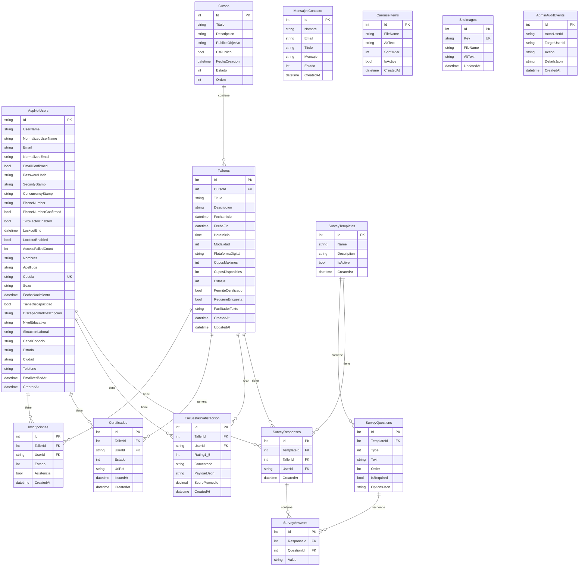

# Diagrama Entidad-Relación - Sumando Valor

## Modelo de Datos

Este documento describe el modelo de datos completo con todas las tablas, campos, tipos de datos, llaves primarias, foráneas e índices.

## Tablas y Campos Detallados

### AspNetUsers (Identity)
**Llave Primaria:** `Id` (string, GUID)

**Campos:**
- `Id` (string, PK) - Identificador único del usuario
- `Email` (string, UK, Required) - Email único
- `Cedula` (string, UK, Required, MaxLength: 20) - Cédula única
- `Nombres` (string, Required, MaxLength: 80)
- `Apellidos` (string, Required, MaxLength: 80)
- `Sexo` (string, Required)
- `FechaNacimiento` (datetime, Required)
- `Telefono` (string, MaxLength: 25, Nullable)
- `DiscapacidadDescripcion` (string, MaxLength: 120, Nullable)
- Otros campos de Identity (PasswordHash, SecurityStamp, etc.)

**Índices:**
- `IX_AspNetUsers_Email` (Unique)
- `IX_AspNetUsers_Cedula` (Unique)

### Cursos
**Llave Primaria:** `Id` (int, Identity)

**Campos:**
- `Id` (int, PK, Identity)
- `Titulo` (string, Required, MaxLength: 150)
- `Descripcion` (string, Required)
- `PublicoObjetivo` (string, MaxLength: 500, Nullable)
- `Estado` (int) - EstatusCurso enum
- `Orden` (int, Nullable)

**Índices:**
- `IX_Cursos_Estado`
- `IX_Cursos_Orden`

### Talleres
**Llave Primaria:** `Id` (int, Identity)

**Campos:**
- `Id` (int, PK, Identity)
- `CursoId` (int, FK, Required)
- `Titulo` (string, Required, MaxLength: 200)
- `Descripcion` (string, MaxLength: 2000, Nullable)
- `FechaInicio` (datetime, Required)
- `FechaFin` (datetime, Nullable)
- `HoraInicio` (time, Required)
- `Modalidad` (int) - ModalidadTaller enum
- `PlataformaDigital` (string, MaxLength: 200, Nullable)
- `CuposMaximos` (int, Required)
- `CuposDisponibles` (int, Required)
- `Estatus` (int) - EstatusTaller enum
- `PermiteCertificado` (bool)
- `RequiereEncuesta` (bool)
- `FacilitadorTexto` (string, MaxLength: 200, Nullable)
- `CreatedAt` (datetime)
- `UpdatedAt` (datetime, Nullable)

**Llaves Foráneas:**
- `FK_Talleres_Cursos_CursoId` → `Cursos.Id` (ON DELETE RESTRICT)

**Índices:**
- `IX_Talleres_CursoId`
- `IX_Talleres_FechaInicio`
- `IX_Talleres_Estatus`

### Inscripciones
**Llave Primaria:** `Id` (int, Identity)

**Campos:**
- `Id` (int, PK, Identity)
- `TallerId` (int, FK, Required)
- `UserId` (string, FK, Required)
- `Estado` (int) - EstadoInscripcion enum
- `Asistencia` (bool)
- `CreatedAt` (datetime)

**Llaves Foráneas:**
- `FK_Inscripciones_Talleres_TallerId` → `Talleres.Id` (ON DELETE RESTRICT)
- `FK_Inscripciones_AspNetUsers_UserId` → `AspNetUsers.Id` (ON DELETE RESTRICT)

**Índices:**
- `IX_Inscripciones_TallerId_UserId` (Unique)
- `IX_Inscripciones_TallerId`
- `IX_Inscripciones_UserId`

### Certificados
**Llave Primaria:** `Id` (int, Identity)

**Campos:**
- `Id` (int, PK, Identity)
- `TallerId` (int, FK, Required)
- `UserId` (string, FK, Required)
- `Estado` (int) - EstadoCertificado enum
- `UrlPdf` (string, Nullable) - Ruta relativa al PDF
- `IssuedAt` (datetime, Nullable)
- `CreatedAt` (datetime)

**Llaves Foráneas:**
- `FK_Certificados_Talleres_TallerId` → `Talleres.Id` (ON DELETE RESTRICT)
- `FK_Certificados_AspNetUsers_UserId` → `AspNetUsers.Id` (ON DELETE RESTRICT)

**Índices:**
- `IX_Certificados_TallerId_UserId` (Unique)
- `IX_Certificados_TallerId`
- `IX_Certificados_UserId`

### EncuestasSatisfaccion
**Llave Primaria:** `Id` (int, Identity)

**Campos:**
- `Id` (int, PK, Identity)
- `TallerId` (int, FK, Required)
- `UserId` (string, FK, Required)
- `Rating1_5` (int, Required) - Calificación 1-5
- `Comentario` (string, MaxLength: 2000, Nullable)
- `PayloadJson` (string) - JSON para extensibilidad
- `ScorePromedio` (decimal(5,2), Nullable)
- `CreatedAt` (datetime)

**Llaves Foráneas:**
- `FK_EncuestasSatisfaccion_Talleres_TallerId` → `Talleres.Id` (ON DELETE RESTRICT)
- `FK_EncuestasSatisfaccion_AspNetUsers_UserId` → `AspNetUsers.Id` (ON DELETE RESTRICT)

**Índices:**
- `IX_EncuestasSatisfaccion_TallerId_UserId` (Unique)
- `IX_EncuestasSatisfaccion_TallerId`
- `IX_EncuestasSatisfaccion_UserId`

### MensajesContacto
**Llave Primaria:** `Id` (int, Identity)

**Campos:**
- `Id` (int, PK, Identity)
- `Nombre` (string, Required, MaxLength: 100)
- `Email` (string, Required, MaxLength: 200)
- `Titulo` (string, Required, MaxLength: 200)
- `Mensaje` (string, Required, MaxLength: 2000)
- `Estado` (int) - EstadoMensaje enum
- `CreatedAt` (datetime)

**Índices:**
- `IX_MensajesContacto_CreatedAt`

### CarouselItems
**Llave Primaria:** `Id` (int, Identity)

**Campos:**
- `Id` (int, PK, Identity)
- `FileName` (string, Required, MaxLength: 260)
- `AltText` (string, Required, MaxLength: 200)
- `SortOrder` (int)
- `IsActive` (bool)
- `CreatedAt` (datetime)

**Índices:**
- `IX_CarouselItems_SortOrder`
- `IX_CarouselItems_IsActive`

### SiteImages
**Llave Primaria:** `Id` (int, Identity)

**Campos:**
- `Id` (int, PK, Identity)
- `Key` (string, Required, MaxLength: 80, Unique) - Clave lógica (ej: "AboutMain", "WorkshopCard")
- `FileName` (string, Required, MaxLength: 260)
- `AltText` (string, Required, MaxLength: 200)
- `UpdatedAt` (datetime)

**Índices:**
- `IX_SiteImages_Key` (Unique)
- `IX_SiteImages_UpdatedAt`

### AdminAuditEvents
**Llave Primaria:** `Id` (int, Identity)

**Campos:**
- `Id` (int, PK, Identity)
- `ActorUserId` (string, Required) - Usuario que ejecutó la acción
- `TargetUserId` (string, Required) - Usuario afectado
- `Action` (string, Required, MaxLength: 80) - Tipo de acción
- `DetailsJson` (string, MaxLength: 4000) - Detalles en JSON
- `CreatedAt` (datetime)

**Índices:**
- `IX_AdminAuditEvents_CreatedAt`
- `IX_AdminAuditEvents_ActorUserId`
- `IX_AdminAuditEvents_TargetUserId`

### SurveyTemplates
**Llave Primaria:** `Id` (int, Identity)

**Campos:**
- `Id` (int, PK, Identity)
- `Name` (string, Required, MaxLength: 200)
- `Description` (string, MaxLength: 4000, Nullable)
- `IsActive` (bool)
- `CreatedAt` (datetime)

**Índices:**
- `IX_SurveyTemplates_IsActive`

### SurveyQuestions
**Llave Primaria:** `Id` (int, Identity)

**Campos:**
- `Id` (int, PK, Identity)
- `TemplateId` (int, FK, Required)
- `Type` (int) - SurveyQuestionType enum
- `Text` (string, Required, MaxLength: 500)
- `Order` (int)
- `IsRequired` (bool)
- `OptionsJson` (string, MaxLength: 4000, Nullable) - Configuración en JSON

**Llaves Foráneas:**
- `FK_SurveyQuestions_SurveyTemplates_TemplateId` → `SurveyTemplates.Id` (ON DELETE CASCADE)

**Índices:**
- `IX_SurveyQuestions_TemplateId_Order`

### SurveyResponses
**Llave Primaria:** `Id` (int, Identity)

**Campos:**
- `Id` (int, PK, Identity)
- `TemplateId` (int, FK, Required)
- `TallerId` (int, FK, Required)
- `UserId` (string, FK, Required, MaxLength: 450)
- `CreatedAt` (datetime)

**Llaves Foráneas:**
- `FK_SurveyResponses_SurveyTemplates_TemplateId` → `SurveyTemplates.Id` (ON DELETE RESTRICT)
- `FK_SurveyResponses_Talleres_TallerId` → `Talleres.Id` (ON DELETE RESTRICT)
- `FK_SurveyResponses_AspNetUsers_UserId` → `AspNetUsers.Id` (ON DELETE RESTRICT)

**Índices:**
- `IX_SurveyResponses_TallerId_UserId` (Unique)
- `IX_SurveyResponses_TemplateId`

### SurveyAnswers
**Llave Primaria:** `Id` (int, Identity)

**Campos:**
- `Id` (int, PK, Identity)
- `ResponseId` (int, FK, Required)
- `QuestionId` (int, FK, Required)
- `Value` (string, Required, MaxLength: 2000) - Respuesta como string

**Llaves Foráneas:**
- `FK_SurveyAnswers_SurveyResponses_ResponseId` → `SurveyResponses.Id` (ON DELETE CASCADE)

**Índices:**
- `IX_SurveyAnswers_QuestionId`

## Reglas de Integridad Referencial

1. **ON DELETE RESTRICT**: Previene eliminación de registros padre si tienen hijos
   - Talleres → Cursos
   - Inscripciones → Talleres, AspNetUsers
   - Certificados → Talleres, AspNetUsers
   - EncuestasSatisfaccion → Talleres, AspNetUsers
   - SurveyResponses → SurveyTemplates, Talleres, AspNetUsers

2. **ON DELETE CASCADE**: Elimina registros hijos al eliminar padre
   - SurveyQuestions → SurveyTemplates
   - SurveyAnswers → SurveyResponses

3. **Unique Constraints**:
   - AspNetUsers.Email (único)
   - AspNetUsers.Cedula (único)
   - SiteImages.Key (único)
   - Inscripciones (TallerId, UserId) - Un usuario solo puede inscribirse una vez por taller
   - Certificados (TallerId, UserId) - Un certificado único por usuario-taller
   - EncuestasSatisfaccion (TallerId, UserId) - Una encuesta por usuario-taller
   - SurveyResponses (TallerId, UserId) - Una respuesta por usuario-taller
